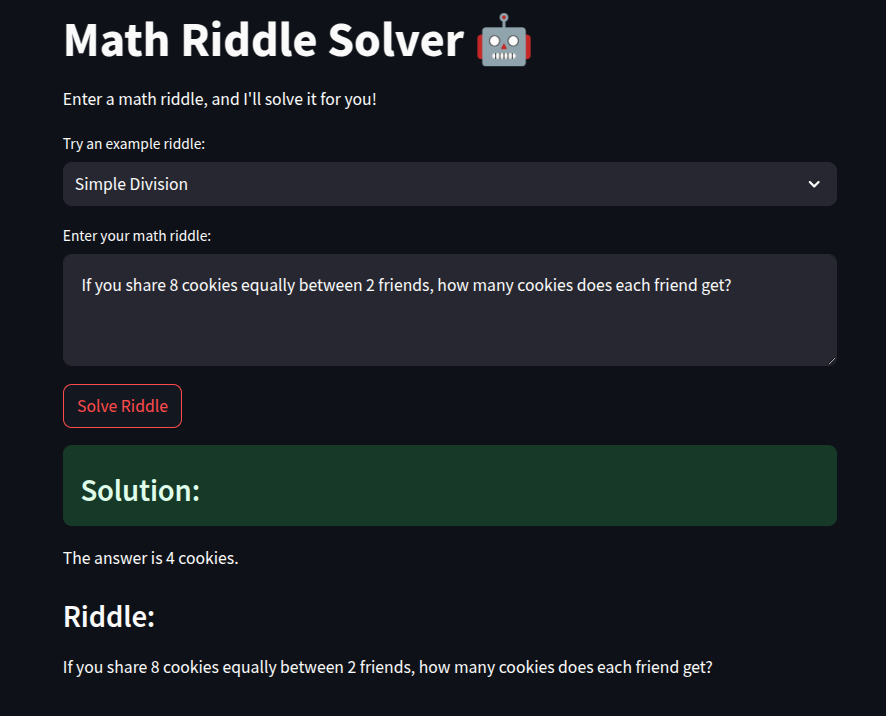
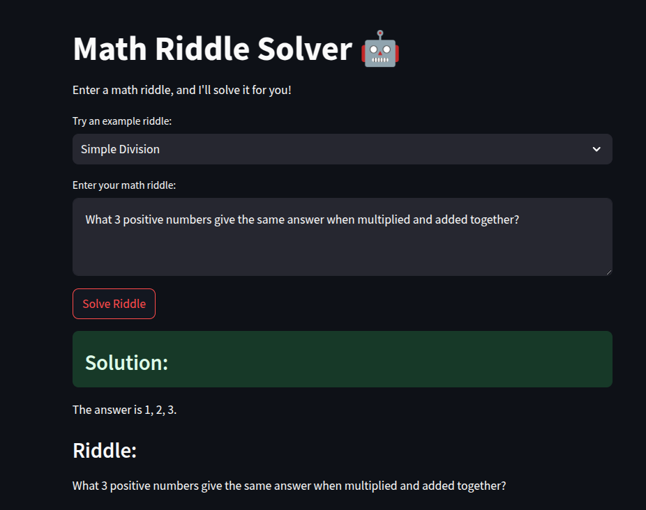

# TinyLlama Math Riddle Solver

A fine-tuned TinyLlama model specialized in solving mathematical riddles and puzzles. The model has been trained on a diverse dataset of mathematical riddles and their solutions, making it adept at understanding and solving various types of math puzzles.

Model Available at: [saadsohail/TinyLlama-math-riddle-solver](https://huggingface.co/saadsohail/TinyLlama-math-riddle-solver)

Blog at:[Riddles, Emojis, and Memes with Maths, featuring Tiny Llama, Deepseek, and Phi-4 fine tuning](https://medium.com/@basil451287/riddles-emojis-and-memes-with-maths-featuring-tiny-llama-deepseek-r1-and-phi-4-fine-tuning-c7aadc00a438)

## Features

- Fine-tuned TinyLlama model for math riddle solving
- FastAPI backend for model inference
- Streamlit web interface
- Pre-loaded with example riddles
- Easy to deploy and use

## Project Structure

```
TinyLlama-Math-Riddle-Solver/
├── app.py                      # Streamlit web interface
├── inference_notebook_HF.ipynb # FastAPI server setup and model inference
├── TinyLlama_mathriddles.ipynb # Model training notebook
├── mathriddles.csv            # Training dataset
├── requirements.txt           # Project dependencies
└── examples/                  # Example outputs and screenshots
```

## Installation

1. Clone the repository:
```bash
git clone https://github.com/saadsohail05/TinyLlama-Math-Riddle-Solver.git
cd TinyLlama-Math-Riddle-Solver
```

2. Create and activate a virtual environment:
```bash
python -m venv venv
source venv/bin/activate  # On Windows: venv\Scripts\activate
```

3. Install dependencies:
```bash
pip install -r requirements.txt
```

## Usage

### Running the Web Interface

1. Start the Streamlit app:
```bash
streamlit run app.py
```

2. Open your browser and navigate to http://localhost:8501

### Running the Model Server

1. Open and run the `inference_notebook_HF.ipynb` notebook
2. The notebook will start a FastAPI server with ngrok tunnel for public access

## Example Outputs

Check out the [examples](examples/) directory for sample interactions with the model. The examples folder contains screenshots demonstrating various use cases and model responses.

<p align="center">
  
</p>
<p align="center">
  
</p>

## Model Details

- Base Model: TinyLlama
- Training Data: Custom dataset of mathematical riddles and solutions
- Fine-tuning Method: LoRA (Low-Rank Adaptation)
- Hugging Face Model: [saadsohail/TinyLlama-math-riddle-solver](https://huggingface.co/saadsohail/TinyLlama-math-riddle-solver)

## Contributing

Feel free to open issues or submit pull requests with improvements.

## License

This project is licensed under the MIT License - see the LICENSE file for details.
